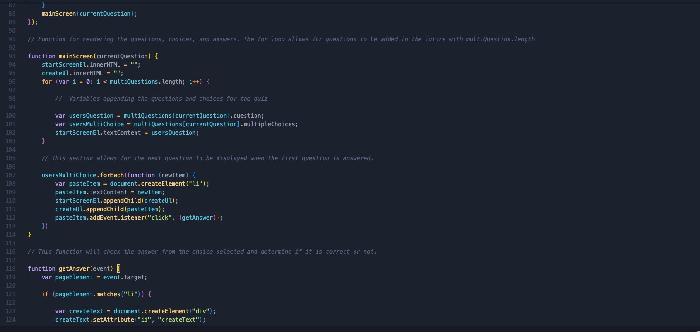

# Web API Quiz

 For this project, I built everything from scratch. I utlilized the skills I learned to build this 5 question quiz game, with multiple choice, and answers, as well as making this a timed quiz. Once the quiz is finished, the quiz will ask to submit your initials and show your score. The quiz will enter in the users input, and store it in local storage. Once the user hits submit, the high score page will display the current and past high scores saved from local storage. Learning Web APIs was both difficult and exciting, and I am proud to show off the skills I have learned so far.

# Website Link

https://goobber33.github.io/Web-API-Quiz/

# Installation

Install the index.html, totalscore.html, style.css, totalscore.css, totalscore.js and script.js and run it in your own IDE. 

# Usage

 A screenshot of some sections of code from my JavaScript for this project. 

Screenshots of the website. The website should resemble this screenshot when deployed.

# Credits

This project was built from scratch by Kyle Parks

https://www.interviewbit.com/javascript-mcq/ Used this site for the multiple choice questions